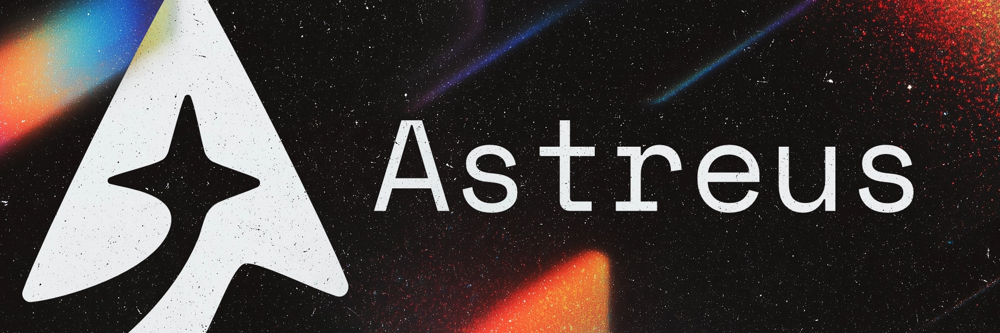

Official website for the Astreus AI Agent Framework.

## About

Documentation and resource website for Astreus - an open-source AI agent framework for building autonomous systems.

## Development

```bash
npm install
npm run dev
```

Built with Next.js 15, React 19, TypeScript, and Fumadocs.

## 📖 Documentation

For detailed documentation and advanced features, visit:
- [Official Documentation](https://astreus.org/docs)
- [Examples](https://astreus.org/docs/examples)

## 🤝 Contributing

Contributions are welcome! Please feel free to submit a Pull Request.

## 📄 License

This project is licensed under the MIT License - see the [LICENSE](LICENSE) file for details.

## 📬 Contact

Astreus Team - [https://astreus.org](https://astreus.org)

Project Link: [https://github.com/astreus-ai/astreus](https://github.com/astreus-ai/astreus) 
